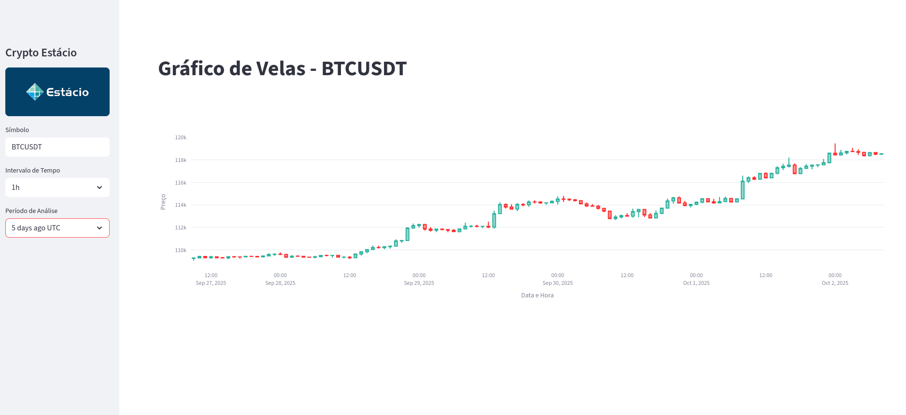

# Dashboard Crypto

⚠️ Em construção...



## 💿 Como rodar na sua máquina (Linux)

### 📝 Pré-requisitos:

- [Git](https://git-scm.com/downloads)
- [Python 3.9 ou maior](https://www.python.org/downloads/)

```bash
# Clonando o projeto e entrando na pasta
$ git clone https://github.com/lleonardus/dashboard-crypto.git
$ cd dashboard-crypto

# Configurando virtual environment e instalando as dependências
$ python3 -m venv .venv
$ source .venv/bin/activate

# Subindo servidor
$ streamlit run app.py
```

## 🧰 Ferramentas Utilizadas

- [git](https://git-scm.com/downloads)
- [python](https://www.python.org/downloads/)
- [streamlit](https://streamlit.io/#install)
- [python-binance](https://python-binance.readthedocs.io/en/latest/overview.html)
- [pandas](https://pandas.pydata.org/docs/getting_started/install.html)
- [plotly](https://plotly.com/python/getting-started/)
- [Pillow](https://pillow.readthedocs.io/en/stable/installation/basic-installation.html)
